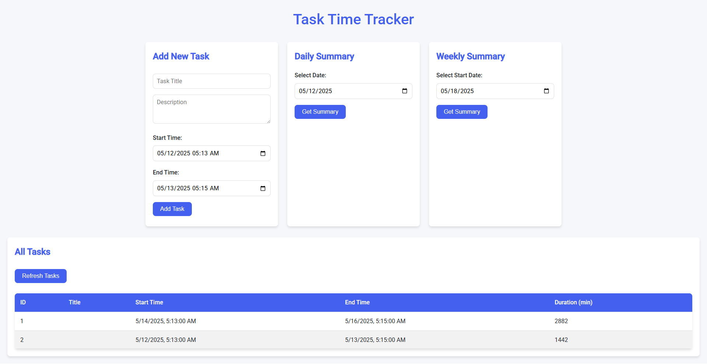

# ⏱️ Task Time Tracker - Spring Boot Application


  


A powerful yet simple time tracking application built with Spring Boot to help you monitor how you spend your time on various tasks.

## 🌟 Features

- **Task Management**: Create, read, update, and delete tasks
- **Time Tracking**: Record start and end times for each task
- **Automatic Duration Calculation**: System calculates time spent on each task
- **Daily/Weekly Summaries**: Get insights into your time allocation patterns
- **RESTful API**: Fully documented endpoints for integration
- **Database Backed**: Persistent storage for all your tasks
- **Ready-to-use Frontend**: Simple HTML interface included

## 🏗️ Why This Architecture?

This application follows **clean architecture principles** with clear separation of concerns:

```
📦 src/main/java/com/example/timetracker
├── 🎮 controller   → REST API endpoints
├── 🏛️ model       → Data structures (entities and DTOs)
├── 🗃️ repository  → Database operations
└── 🛠️ service     → Business logic
```

This structure ensures:
- **Maintainability**: Easy to update and extend
- **Testability**: Components can be tested in isolation
- **Scalability**: Ready for future enhancements
- **Best Practices**: Follows Spring Boot conventions

## 🚀 Getting Started

### Prerequisites

- Java 17+
- Maven 3.6+
- (Optional) Your favorite IDE (IntelliJ, Eclipse, etc.)

### Installation

1. Clone the repository:
   ```bash
   git clone https://github.com/yourusername/task-time-tracker.git
   cd task-time-tracker
   ```

2. Build the project:
   ```bash
   mvn clean install
   ```

3. Run the application:
   ```bash
   mvn spring-boot:run
   ```

### Access Points

- **API Documentation**: `http://localhost:8080/api/tasks`
- **H2 Database Console**: `http://localhost:8080/h2-console`
  - JDBC URL: `jdbc:h2:mem:timeTrackerDB`
  - Username: `sa`
  - Password: (leave empty)
- **Web Interface**: `http://localhost:8080/index.html`

## 🛠️ API Endpoints

| Method | Endpoint | Description |
|--------|----------|-------------|
| `GET` | `/api/tasks` | Get all tasks |
| `GET` | `/api/tasks/{id}` | Get specific task |
| `POST` | `/api/tasks` | Create new task |
| `PUT` | `/api/tasks/{id}` | Update existing task |
| `DELETE` | `/api/tasks/{id}` | Delete task |
| `GET` | `/api/tasks/date/{date}` | Get tasks for specific date |
| `GET` | `/api/tasks/week/{date}` | Get tasks for specific week |
| `GET` | `/api/tasks/summary/daily/{date}` | Get daily summary |
| `GET` | `/api/tasks/summary/weekly/{date}` | Get weekly summary |

## 📊 Sample JSON Payload

**Create Task:**
```json
{
    "title": "Project Planning",
    "description": "Weekly sprint planning meeting",
    "startTime": "2023-05-01T14:00:00",
    "endTime": "2023-05-01T15:30:00"
}
```

**Sample Response:**
```json
{
    "id": 1,
    "title": "Project Planning",
    "description": "Weekly sprint planning meeting",
    "startTime": "2023-05-01T14:00:00",
    "endTime": "2023-05-01T15:30:00",
    "durationInMinutes": 90
}
```

## 🌈 Why Use This Application?

- **Boost Productivity**: Understand where your time goes
- **Improve Estimates**: Better predict task durations
- **Identify Patterns**: Spot time-wasters or productive periods
- **Simple Integration**: Use the API with your existing tools
- **Self-hosted**: Your data stays private and secure

## 🧑‍💻 Development Guide

### Database Configuration

By default, the app uses H2 in-memory database. To switch to MySQL/PostgreSQL:

1. Update `application.properties`:
   ```properties
   spring.datasource.url=jdbc:mysql://localhost:3306/timetracker
   spring.datasource.username=youruser
   spring.datasource.password=yourpassword
   spring.jpa.hibernate.ddl-auto=update
   ```

2. Add the appropriate JDBC driver to `pom.xml`

### Testing

Run the test suite with:
```bash
mvn test
```

### Code Style

We follow Google Java Style Guide. Use the provided formatter in your IDE.

## 🤝 Contributing

We welcome contributions! Please follow these steps:

1. Fork the project
2. Create your feature branch (`git checkout -b feature/AmazingFeature`)
3. Commit your changes (`git commit -m 'Add some AmazingFeature'`)
4. Push to the branch (`git push origin feature/AmazingFeature`)
5. Open a Pull Request

## 📜 License

Distributed under the MIT License. See `LICENSE` for more information.

---

Made with ❤️ and ☕ by Niloy Ahmed
